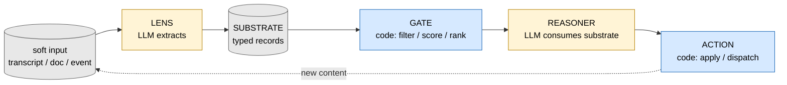

# hybrid — a design pattern for LLM-and-code cycles

**A cycle, not a pipeline.** Concretely: a tool that watches a recurring stream of soft input — agent traces, evaluator outputs, meeting transcripts, knowledge-base entries — labels each new item against a curated vocabulary, and flags when a pattern you said you'd address recurs. LLM extracts (lens) → typed records accumulate (substrate) → deterministic code filters and ranks (gate) → LLM reasons over the filtered slice (reasoner) → notification or action lands. Each new item becomes input for the next turn's lens.

That's a *hybrid loop*. The design pattern places LLM judgment and deterministic code in alternating layers that *mutually generate each other's working surface* — not just constraining each other, but producing the very inputs the other half operates over. The LLM generates typed records (and often the schema, notation, or code those records live in). The deterministic layer takes those records and produces filtered, scored, ranked context that becomes the next LLM call's input. Each half makes the other possible.



Yellow = LLM acts. Blue = code acts. Grey = data flowing between. Two meta-layers close additional loops: *calibration* (predict + verdict log per evaluator — does the lens actually work?) and *metabolism* (substrate-wide audit — is the accumulated record drifting?).

## What this project actually is

What you get from reading this repo: a vocabulary for naming recurring shapes in LLM-and-code systems, a Claude Code skill that auto-triggers when you describe one of those shapes, and pointers to working repos exemplifying each shape.

The skill is diagnostic-first — most projects don't need this pattern, and the skill tells Claude when not to use it. When a project does need it, the skill points at a library of recognizable shapes (RAG, ReAct, codegen-with-verification, multi-agent panels, the canonical 5-role hybrid loop, dev-time critique loops, knowledge-base auditors, plus a couple of cross-domain metaphors for the shape) so the design conversation has somewhere to start.

The framework's actual content is the *disciplines* the new block type (LLMs as fuzzy pattern mappers) requires beyond the conventional von-Neumann graph algebra: per-block calibration, context-as-code as load-bearing infrastructure, and the dev-time hybrid loop wrapping the runtime. These are named in [`THE_CASE.md`](skills/hybrid-loops/references/THE_CASE.md).

## Who it's for

- AI engineers shipping production LLM features. The framework provides a unifying vocabulary for what DSPy / LangGraph / AutoGen / pydantic each implement pieces of, and names the disciplines those tools leave open: calibration, context-as-code, dev-time loops.
- Solo developers and small teams building tools that involve LLM judgment, who haven't internalized the agent-framework ecosystem yet and want a starting model.

## Install — Claude Code

The skill is markdown; install it however you prefer.

**Symlink (simplest, recommended for solo use):**

```bash
ln -s /path/to/hybrid/skills/hybrid-loops ~/.claude/skills/hybrid-loops
```

**Marketplace install (discoverable, recommended for sharing):**

```bash
/plugin marketplace add justinstimatze/hybrid
/plugin install hybrid-loops@hybrid-loops
```

Either path gives you the same thing: the `hybrid-loops` skill auto-triggers on relevant prompts. To confirm install worked, type something like *"build me a tool that watches my evaluator outputs and flags when a regression pattern recurs"* — the skill should activate and start asking diagnostic questions about surfaces, scope, and shape. If it doesn't, the install didn't take — file a GitHub issue.

The marketplace command requires this GitHub repo to be reachable. For forks or local development, use the local-path forms: `/plugin marketplace add /path/to/hybrid` and `/plugin install hybrid-loops@hybrid-loops`.

## Install — other agents

The skill content is model-agnostic. Stub manifests are included for OpenAI Codex, Cursor, and Gemini — see `CROSS_AGENT.md`. The maintainer's primary platform is Claude Code; PRs from users on other agents are welcome.

## Where to start reading

If you arrived here cold and want one entry point: [`SKILL.md`](skills/hybrid-loops/SKILL.md) is the operational center.

The reference docs each have a different reader in mind:

| if you... | read |
|---|---|
| are skeptical this is anything more than 1945 von Neumann | [`THE_CASE.md`](skills/hybrid-loops/references/THE_CASE.md) (the algebra-vs-alphabet-vs-disciplines argument) |
| want to scaffold a hybrid-loop project by analogy | [`BLOCK_GRAPHS.md`](skills/hybrid-loops/references/BLOCK_GRAPHS.md) (catalog of recognizable compositions with Mermaid diagrams) |
| want the algebra of the eight primitive blocks | [`BUILDING_BLOCKS.md`](skills/hybrid-loops/references/BUILDING_BLOCKS.md) |
| think this is just DSPy / LangGraph / AutoGen / pydantic with extra theory | [`AGENT_FRAMEWORKS.md`](skills/hybrid-loops/references/AGENT_FRAMEWORKS.md) (per-tool comparison + adjacent ecosystems) |
| are doing a lit review | [`PRIOR_ART.md`](skills/hybrid-loops/references/PRIOR_ART.md) (4-tier citation index) |
| want to think about composition past v0 | [`STACKING.md`](skills/hybrid-loops/references/STACKING.md) (runtime vs dev-time stacking) |

## Runnable instances in the wild

The pattern is illustrated in working repos rather than via a canonical example in this one — diagnostic-first means there's no single "hello world" hybrid loop; the right shape depends on the surface, and the surface is project-specific. **If you only have time to read one, start with [winze](https://github.com/justinstimatze/winze)**: it's a knowledge base that maintains its own model of reality, audits itself for cognitive biases, predicts where it's wrong, and tracks whether it's right — three of the framework's roles in one project, end-to-end.

Then reach for the entry in [`BLOCK_GRAPHS.md`](skills/hybrid-loops/references/BLOCK_GRAPHS.md) that matches your project's surface, and pick from the list below for shape.

### Maintainer's projects

The shape characterizations below are this writeup's reading of the maintainer's own work:

- **[winze](https://github.com/justinstimatze/winze)** — *knowledge-base-auditor + calibration*. A KB that maintains its own model of reality, audits itself for cognitive biases, predicts where it's wrong, tracks whether it's right. The most direct on-pattern instance.
- **[hindcast](https://github.com/justinstimatze/hindcast)** — *calibration substrate over the agent itself*. Per-project BM25-kNN over the maintainer's own past turn durations, surfaced as a calibrated wall-clock prior in Claude Code's context. The substrate is the agent's own behavior; the loop closes when the next turn's actual duration becomes a new training example. Cleanest calibration-discipline instance in the stack.
- **[defn](https://github.com/justinstimatze/defn)** — *knowledge-base-auditor* applied to Go code. Round-trips between Go AST and SQL view; deterministic AST audits flag structural issues; LLM proposes edits to source.
- **[slimemold](https://github.com/justinstimatze/slimemold)** — *conversation-topology hook*. Claude Code hook that extracts claims per turn, runs a graph topology audit, injects a suggested response into the next turn's context.
- **[effigy](https://github.com/justinstimatze/effigy)** — *dense-notation NPC*. LLM authors character notation once at dev-time; deterministic context assembly per runtime turn; LLM consumes the assembled context to generate output.
- **[gemot](https://github.com/justinstimatze/gemot)** — *adversarial-panel review*. Structured deliberation MCP server for multi-agent coordination.
- **[ismyaialive](https://github.com/justinstimatze/ismyaialive)** — *lens + substrate-as-vocabulary*. Identifies patterns in AI conversations (sycophancy, validation cascades) against published research codebooks.
- **[drivermap](https://github.com/justinstimatze/drivermap)** — *substrate-as-vocabulary* in pure form. Behavioral-mechanisms KB; agents consume the typed library to predict and verbalize human behavior.
- **[score](https://github.com/justinstimatze/score)** — *coach's typed-move-library* applied to immersive-experience design. 356-play library + structural linter + participant planner + Miro sidebar app.
- **[adit-code](https://github.com/justinstimatze/adit-code)** — *structural-analysis substrate*. Deterministic metrics on AI-edited codebases identify high-friction files; LLM-readable findings tell you what to refactor.
- **[plancheck](https://github.com/justinstimatze/plancheck)** — *codegen-with-verification*. Deterministic compiler over an ExecutionPlan JSON checks file existence, orphan detection, cascade risk; LLM revises plan against structured findings; iterates until score threshold clears. Deterministic side has structural authority over the LLM side.
- **[lucida](https://github.com/justinstimatze/lucida)** — *ambient lens*. Passive Claude Code observer; LLM extracts viz-worthy structures from conversation; deterministic renderer mints Vega/Mermaid/SVG outputs.
- **[gastown](https://github.com/justinstimatze/gastown)** — *multi-agent orchestration*. Workspace manager for coordinating 20–30 agents with persistent state and a three-tier watchdog (also cited in `references/PRIOR_ART.md` Tier 2).
- **[buddy](https://github.com/justinstimatze/buddy)** — coding companion (tamagotchi-style: 21 species, persistent personality, MCP-client-agnostic). The maintainer's contribution is essentially a port of slimemold's hook architecture into the companion shell.
- **[groupchat](https://github.com/justinstimatze/groupchat)** — *substrate-as-vocabulary, playful register*. 66-entry typed meme library with `deploy_when` / `too_much_if` / `mechanism` / cooldown metadata; LLM picks against the substrate, deterministic cooldown gates, action drops to terminal. Demonstrates that the substrate-as-vocabulary discipline scales beyond serious-work surfaces.

### Adjacent practitioner work — Manuel Odendahl ("wesen")

This writeup is meaningfully shaped by **wesen's** prior work. His stack at [github.com/go-go-golems](https://github.com/go-go-golems) and his writing at [the.scapegoat.dev](https://the.scapegoat.dev) directly influenced how this pattern is described — the *generalization shaping* framing, the use of "diary" over "log," "mapping" / "interface-mapping" as the right way to describe what an LLM does at the systems-design level, and "substrate" for typed event-streaming layers are all his. He'd describe his own projects in his own vocabulary — these aren't instances of *this writeup's* taxonomy, they're independent practitioner work in the same broader space, and they reward reading on their own terms.

Worthwhile entry points to his ecosystem (linked here as a friendly pointer; his framing lives in his own READMEs and essays):

- **[geppetto](https://github.com/go-go-golems/geppetto)** — Go LLM framework with a typed-step abstraction underpinning much of his stack
- **[pinocchio](https://github.com/go-go-golems/pinocchio)** — CLI/REPL frontend; YAML-based prompt-library-with-metadata
- **[go-go-agent](https://github.com/wesen/2026-04-29--go-go-agent)** — terminal agent with an explicit evidence database for replay and inspection
- **[Codex-Reflect-Skill](https://github.com/wesen/Codex-Reflect-Skill)** — runs Codex over past Codex sessions to surface patterns and propose new skills
- **[sessionstream](https://github.com/go-go-golems/sessionstream)** — typed event-streaming substrate
- **[docmgr](https://github.com/go-go-golems/docmgr)** — structured document manager for LLM-assisted workflows

For the full credit and complementarity-with-this-writeup account, see [`PRIOR_ART.md`](skills/hybrid-loops/references/PRIOR_ART.md) Tier 1.

## What's in the repo

```
hybrid/
├── README.md
├── skills/hybrid-loops/
│   ├── SKILL.md            the skill (one-screen TL;DR + 5-phase diagnostic)
│   └── references/         the framework's actual content (loaded on demand by the skill)
├── .claude-plugin/         Claude Code plugin + marketplace manifests
├── .codex-plugin/          Codex stub (community PRs welcome)
├── .cursor-plugin/         Cursor stub (community PRs welcome)
├── gemini-extension.json   Gemini stub (community PRs welcome)
└── CROSS_AGENT.md          portability notes
```

The repo is markdown + manifests. There's no shipped code beyond the skill itself; the disciplines are illustrated by the runnable instances above (maintainer's other repos and wesen's), not by anything in this directory.

## Status

**Practitioner notes, not a research artifact.** Not sold, not a SaaS. The maintainer also runs [gemot](https://github.com/justinstimatze/gemot), a commercial product built with this perspective. Audience is overwhelmingly AI engineers.

## Naming

"Hybrid loops" is the *working name in this repo*, not a claim of universal nomenclature. The broader field has no settled name. Adjacent terms with partial coverage:

- *"Compound AI systems"* (Zaharia et al., BAIR 2024) — broader umbrella; this pattern is one shape inside it
- *"Generalization shaping"* (Manuel Odendahl / wesen, 2026) — the design principle inside hybrid loops; closest practitioner framing
- *"Structured prompt-driven development"* (Patel/Sharif/Fowler, martinfowler.com 2026) — closest engineering-discipline cousin in current practitioner literature
- *"Compound engineering"* (Klaassen, Every.to 2026) — adjacent practitioner methodology
- *"Cognitive Architectures for Language Agents" / CoALA* (Sumers et al., NeurIPS 2024) — academic taxonomy

The pattern can be cited by any of these names. See [`AGENT_FRAMEWORKS.md`](skills/hybrid-loops/references/AGENT_FRAMEWORKS.md) and [`PRIOR_ART.md`](skills/hybrid-loops/references/PRIOR_ART.md) for full positioning.

## Acknowledgments

Wesen's shaping influence is credited where his projects are linked under "Runnable instances in the wild" above; full attribution is in [`PRIOR_ART.md`](skills/hybrid-loops/references/PRIOR_ART.md).

The word *fuzzy* in *fuzzy pattern mapper* inherits a 60-year tradition through Lotfi Zadeh's soft-computing umbrella (fuzzy logic, neural nets, GAs, Bayesian nets, HMMs).

Thanks also to the published work of [DreamCoder](https://github.com/ellisk42/ec) (Ellis et al., 2021), [LILO](https://github.com/gabegrand/lilo) (Grand et al., 2024), [Voyager](https://github.com/MineDojo/Voyager) (Wang et al., 2023), [DSPy](https://arxiv.org/abs/2310.03714) (Khattab et al., 2023), [CoALA](https://arxiv.org/abs/2309.02427) (Sumers et al., NeurIPS 2024), [Anthropic's Building Effective Agents](https://www.anthropic.com/engineering/building-effective-agents) (2024), and [Compound AI Systems](https://bair.berkeley.edu/blog/2024/02/18/compound-ai-systems/) (Zaharia et al., BAIR 2024). Devine Lu Linvega ([100r.co](https://100r.co)) and the Hundred Rabbits collective inform the small-tools aesthetic the deterministic-shell half of the pattern aspires to. Christopher Alexander's *A Pattern Language* (1977) is the structural reference for what the pattern *is* as a unit of design.

## License

MIT.
