# Block-graphs: a library of stuck-together hybrid loops

A reference catalog of recognizable hybrid-loop systems, expressed as block graphs. Use this when scaffolding by analogy — find the entry closest to your project's surface, start from that arrangement, then adjust.

**Catalog (twelve shapes, four groups):**

- *Well-known patterns the field already names*: RAG, ReAct, Codegen-with-verification, Multi-agent conversation
- *Canonical hybrid-loop shapes*: 5-role canonical loop, Compress-and-verify schema discovery, Adversarial panel review, Dev-time critique loop wrapping a runtime
- *Specific shapes worth recognizing*: Knowledge-base auditor, Dense-notation NPC, Conversation-topology hook
- *Cross-domain metaphors* (non-engineering surfaces used to make the shape vocabulary land — illustrative, not deployed): Teacher's intervention tracker, Coach's typed move-library

**Convention used in every diagram below.** Shapes and arrow styles are the visual key:

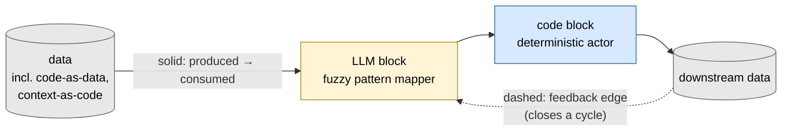

Entries are loosely grouped: well-known patterns the field already names, then canonical hybrid-loop shapes, then a few specific examples.

---

## Well-known patterns

### RAG — Retrieval-Augmented Generation

The simplest hybrid-loop shape after "just call an LLM." Code retrieves relevant context; LLM generates a response grounded in it.

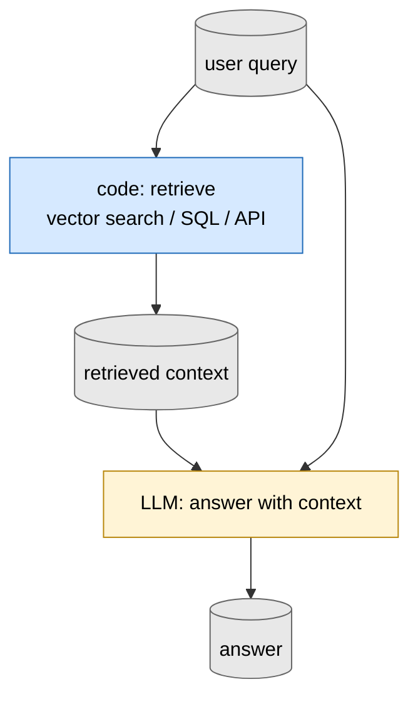

The user query goes both to retrieval (find relevant context) and to the LLM (generate an answer alongside the retrieved data). The deterministic retrieval block does what the LLM would do badly — precise lookup over a large corpus. The LLM does what retrieval can't — generate fluent answers integrating retrieved facts. Calibration block (not drawn) typically logs query → answer with later signal of helpfulness.

**In the wild**: Perplexity, ChatGPT with web search, Sourcegraph Cody, and almost every "talk to your documents" enterprise product.

### ReAct — Reason + Act with tool calls

Agentic shape: LLM decides what to do, deterministic tool runs, LLM reads the result, LLM decides next action. Loops until done.

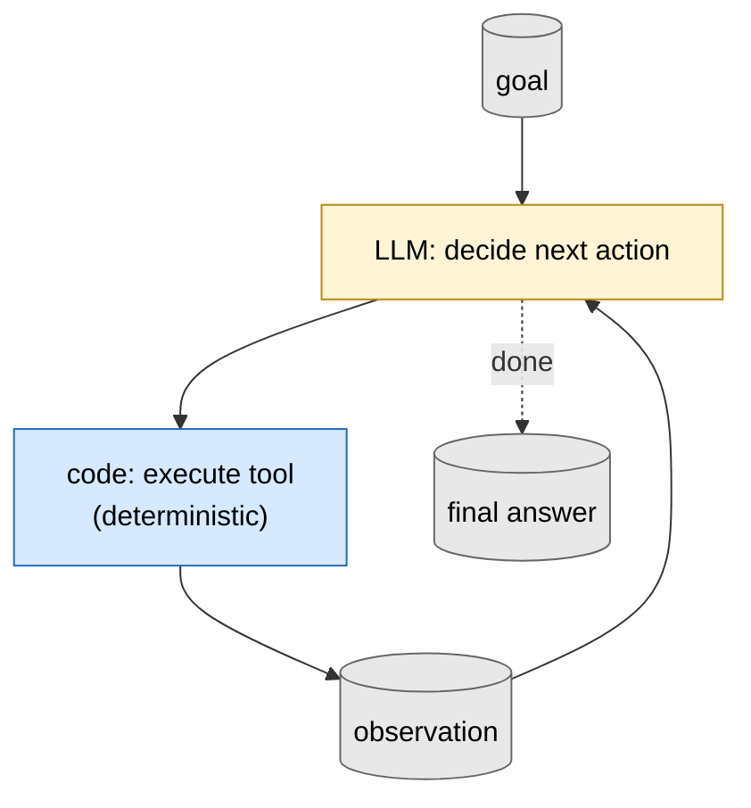

The LLM provides flexible decision-making over the tool repertoire; the deterministic tools provide grounded effects (search, math, code execution, API calls). Each tool is a typed pattern mapper; the LLM block is the controller. Without the deterministic tools the LLM hallucinates; without the LLM controller the tools have no plan.

**In the wild**: Claude Code, Cursor, Devin, and the broader tool-use ecosystem (Anthropic's tool-use API, the AutoGPT/BabyAGI lineage). Original paper: Yao et al. 2022, [ReAct: Synergizing Reasoning and Acting](https://arxiv.org/abs/2210.03629).

### Codegen with verification

LLM proposes code; deterministic verifier checks it; LLM revises on failure. The pattern that makes "have the LLM write the code" actually work — though the kind of verifier matters, and in modern coding harnesses this pattern is usually absorbed into a ReAct loop rather than appearing standalone.

Two flavors of verifier sit at different abstraction levels:

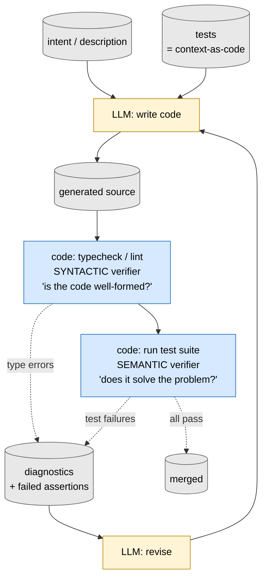

*Syntactic verifier* (typechecker, linter, parser): "is the code locally well-formed?" Cheap, structural, doesn't know what the program is supposed to do.

*Semantic verifier* (test suite, integration test, schema validator with examples): "does this code do what we wanted?" The tests themselves are *context-as-code* — an artifact encoding the intent the LLM is trying to satisfy. Tests can be written by a human (LLM-reads-spec-and-tests-and-code) or by the LLM as part of the same loop. Different answer to "where does intent come from."

**Modern absorption.** In 2023 codegen-with-verification was often standalone — give an LLM a function signature, get back a function with tests, run the tests, iterate. By 2026 the pattern usually lives inside a [ReAct](#react--reason--act-with-tool-calls) loop where the test runner is one tool among many. The diagram above is the conceptually-clean version; in practice you'll see ReAct with a test-runner tool. The shape still matters as a teaching diagram — it makes the syntactic-vs-semantic distinction visible, and it shows the deterministic verifier is what makes the LLM's authoring trustworthy enough to ship.

**In the wild**: Aider's auto-test mode, Cursor's debug-with-tests workflow, the SWE-bench harness setup (agent + test suite per task), Claude Code with test-runner subagents. The TypeScript/Python type-checker tightens the loop in IDE coding-assist generally.

### Multi-agent conversation

Two or more LLM blocks exchanging typed messages, often with a coordinator that decides whose turn it is. The basic shape behind AutoGen, CrewAI, etc.

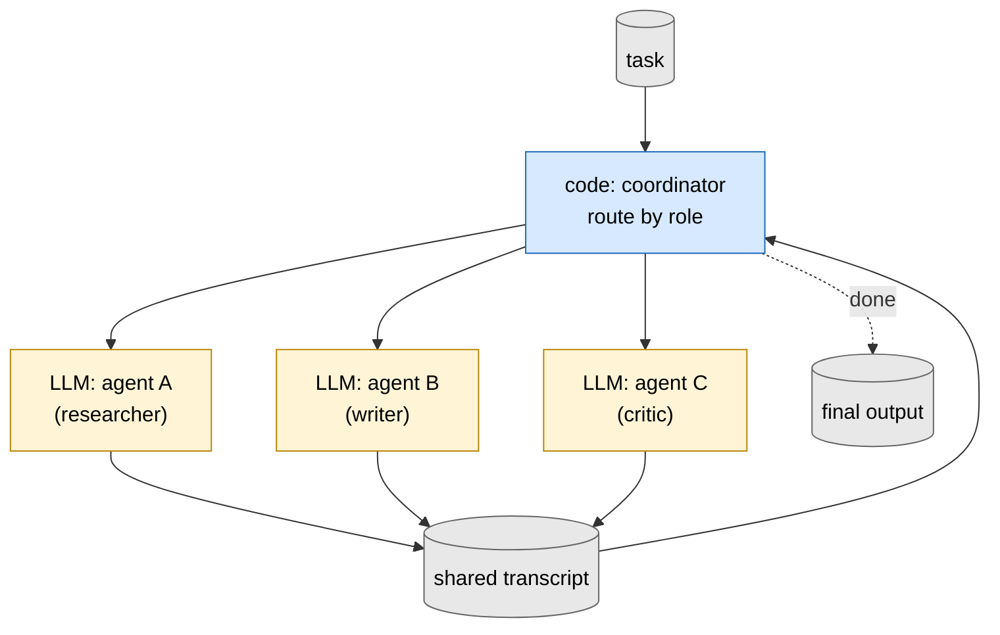

The shared transcript is the substrate; the coordinator is the deterministic gate that decides routing. Whether the shape works depends on whether agents have meaningfully different roles or whether they all reach for the same answer — in the latter case they're an expensive ensemble of one.

**In the wild**: AutoGen, CrewAI, and OpenAI's Swarm cover the production end; [ChatDev](https://github.com/OpenBMB/ChatDev) and [MetaGPT](https://github.com/geekan/MetaGPT) are the academic instances. The "agent crew" pattern dominates much of the 2024-2025 multi-agent literature.

---

## Canonical hybrid-loop shapes

### The 5-role canonical hybrid loop

The arrangement the skill defaults to. Lens extracts; substrate accumulates; gate filters; reasoner consumes; action lands and feeds back.

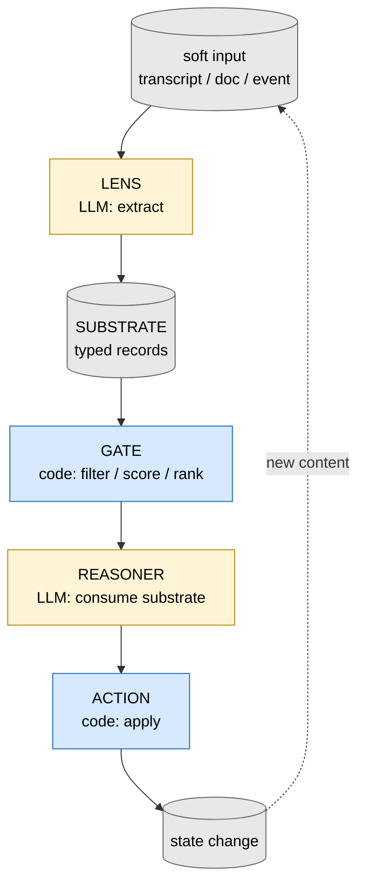

The cycle closes when the action produces new content the lens reads next turn. *Calibration* (predict + verdict per LLM block) and *metabolism* (substrate-wide audit) close additional loops not drawn here.

**In the wild**: most production hybrid-loop projects collapse into roughly this shape. Anthropic's "Building Effective Agents" workflow tier maps onto it. Many enterprise document-processing pipelines (extract → store → filter → reason → act) instantiate it without naming it. Compare with CoALA's (Sumers et al. 2024) memory + actions + decision-making decomposition.

### Compress-and-verify schema discovery

Iteratively design a dense notation for a corpus by compressing items, expanding them back, scoring fidelity, and evolving the notation across rounds. The DreamCoder / LILO descendant.

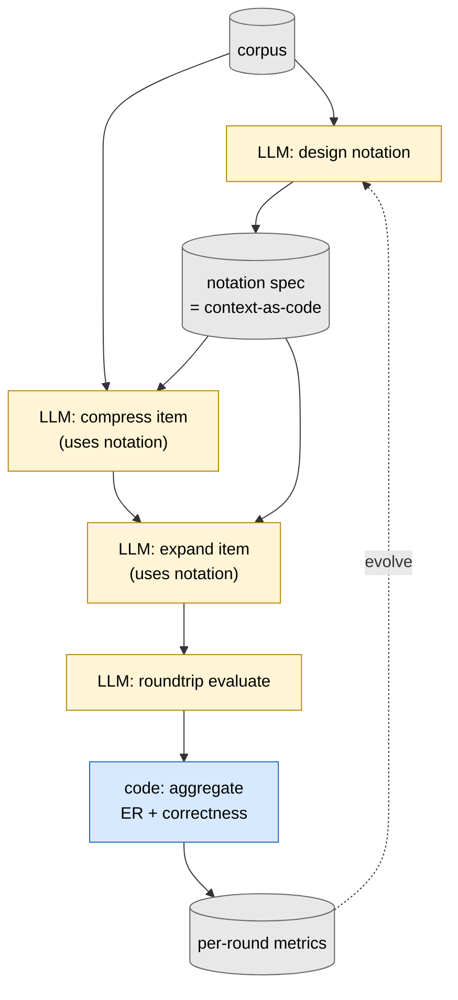

Almost every block is an LLM; the deterministic block is just metric aggregation. The notation is *context-as-code* — the LLM authors it, then later LLMs use it as instructions. The ER/correctness metrics close the dev-time loop on whether evolving the notation improved the system.

**In the wild**: DSPy's compile step (Khattab et al. 2023, [arXiv:2310.03714](https://arxiv.org/abs/2310.03714)) is the closest published cousin — optimizes prompts/demos against a metric. The DreamCoder lineage (Ellis et al. 2021) is the academic ancestor.

### Adversarial panel review

Multiple LLM critics read the same artifact in parallel, each with a different domain lens; deterministic prioritization picks targets; an LLM patches.

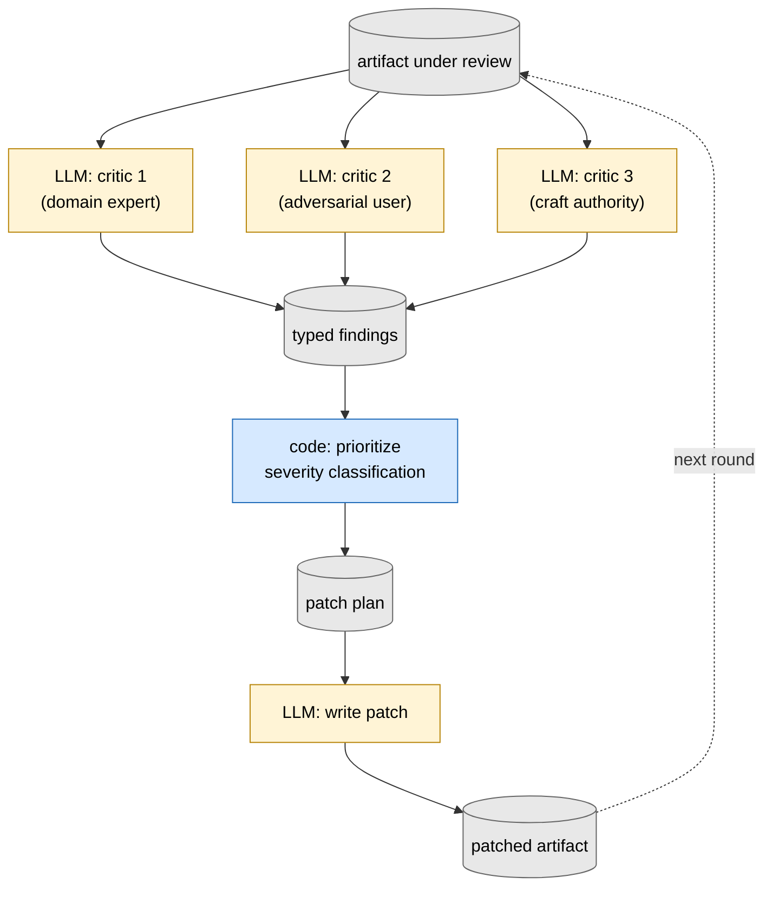

Parallel LLM blocks doing different jobs (each with its own role-as-context-as-code) → typed substrate of findings → deterministic prioritization → patch generation. Used for design review, code review, content critique. The deterministic prioritization is what makes the panel's output actionable instead of overwhelming.

**In the wild**: Reflexion (Shinn et al. 2023, [arXiv:2303.11366](https://arxiv.org/abs/2303.11366)) — agent reflects on its own trajectory, generates verbal feedback, retries. Agent-as-judge / LLM-as-judge eval frameworks (Zhuge et al. 2024). Anthropic's [Constitutional AI](https://www.anthropic.com/research/constitutional-ai) critique loop. Cursor's "review my diff" multi-agent mode. The broader LLM-as-judge literature.

### Dev-time critique loop wrapping a runtime loop

The most common stacked shape. Inner cycle is the runtime; outer cycle reads runtime transcripts and patches the runtime layers below.

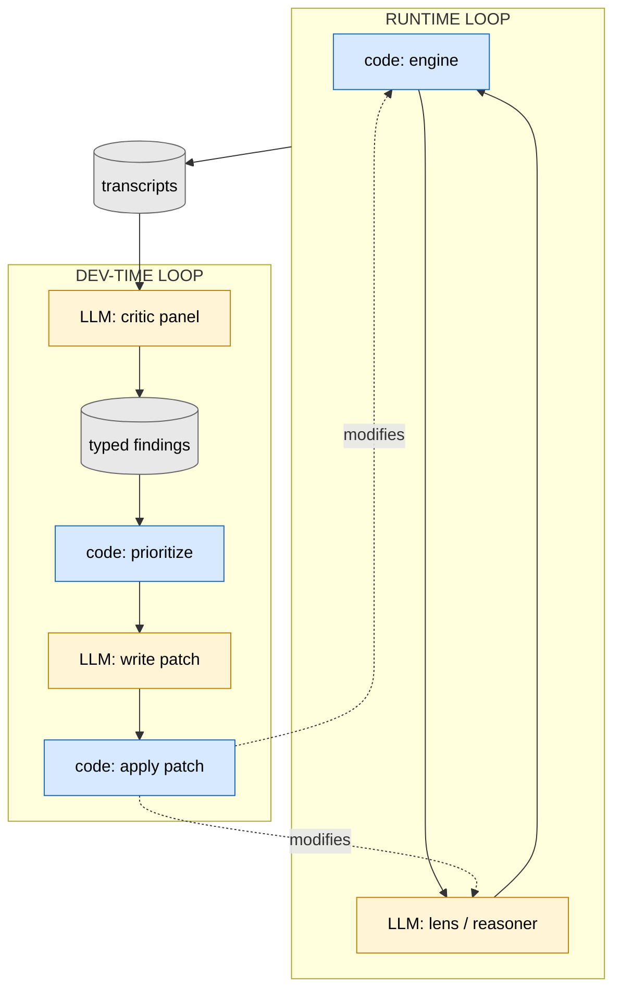

The runtime stays small (one or two cycles per user-facing decision); the dev loop iterates many times across runs. Most real systems live in the dev-time regime — that's where compounding improvement happens. Compound engineering's "compound" step is exactly this shape; SPDD's "fix the prompt first" rule operationalizes the patch step.

**In the wild**: [Compound engineering](https://every.to/guides/compound-engineering) (Klaassen et al., Every.to). [Structured Prompt-Driven Development](https://martinfowler.com/articles/structured-prompt-driven/) (Patel/Sharif/Fowler, martinfowler.com). Game-AI playtesting → critique → patch → re-playtest pipelines. Post-incident-review loops in SRE generally (the SLI/SLO/error-budget framework is a calibration-shaped variant). Stope-style adversarial-panel-review pipelines.

---

## Specific shapes worth recognizing

### Knowledge-base auditor

Substrate is valid source code (often Go AST); auditors run deterministic checks against the AST; an LLM proposes edits to the substrate.

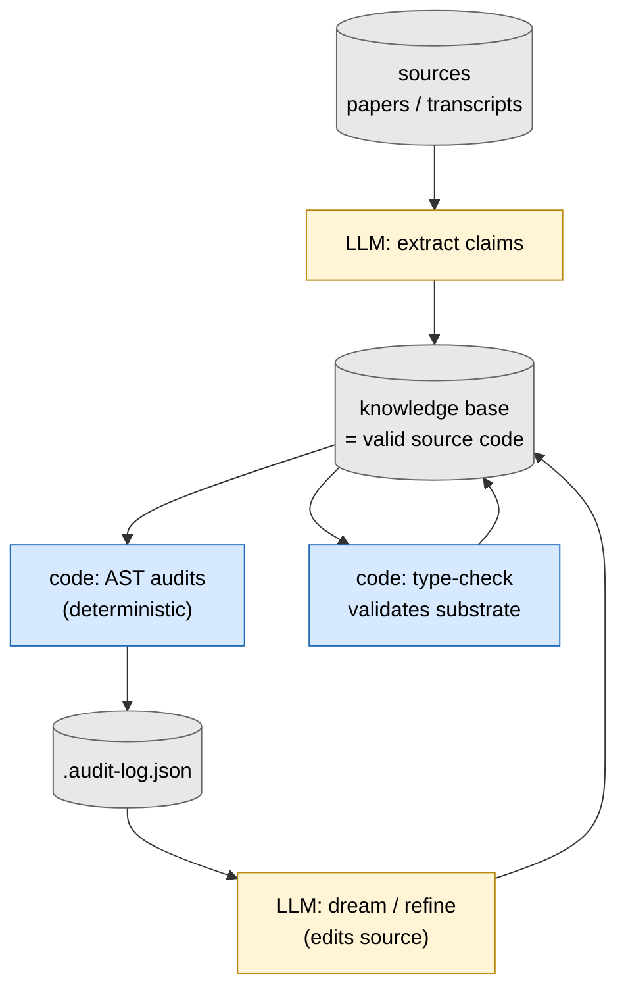

Code-as-substrate does triple duty: LLM-readable (no markdown intermediate), executable (the language runtime can run it), analyzable by deterministic tools (linters, type checkers, AST queries). One artifact, three readers.

**In the wild**: less common as a deployed shape — most knowledge bases use markdown or RDF-style triples. AI-augmented codebases that treat *the code itself* as a knowledge artifact ([defn](https://github.com/justinstimatze/defn) round-trips between Go AST and SQL view). The OpenCog tradition is the academic cousin. Concept-tracking PKM tools (Logseq, Roam) approach this from the other direction with structured-content + light analysis but typically lack the LLM-author + deterministic-validate triple.

### Dense-notation NPC with runtime context assembly

LLM authors a dense notation file once (offline); deterministic code assembles runtime context per turn from game state; LLM consumes the assembled context to generate output. Effigy-shape.

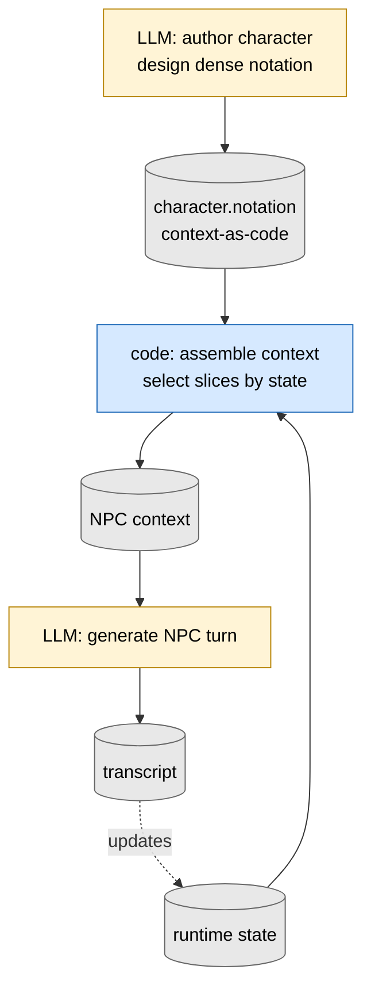

The notation is authored once at dev time and treated as production code thereafter. Runtime context assembly is fast and deterministic; the LLM sees only the slice relevant to the current state. Same shape works for any persona-driven LLM application — customer-service personas, tutoring systems, coaching tools.

**In the wild**: [character.ai](https://character.ai/)'s persona system (deeper persona-conditioning happens server-side). NVIDIA's [NeMo Guardrails](https://github.com/NVIDIA/NeMo-Guardrails) for character constraints. [Effigy](https://github.com/justinstimatze/effigy) is a runnable instance for dense-character notation.

### Conversation-topology hook

LLM extracts claims from each conversation turn; deterministic topology audit identifies structural risks (load-bearing-but-unchallenged claims); deterministic injection adds a suggested response into the next turn's context.

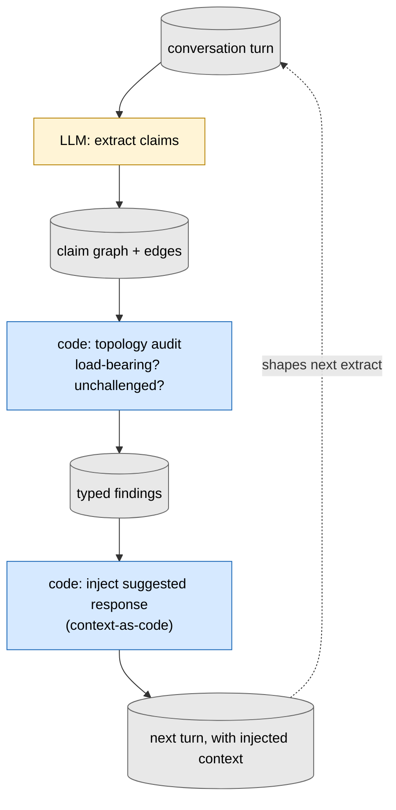

The injected suggested response is *context-as-code* — text in markdown that the next LLM call interprets as instructions. The topology audit is a pure-graph computation; the LLM doesn't need to assess its own reasoning, the deterministic gate does. Slimemold-shape.

**In the wild**: [slimemold](https://github.com/justinstimatze/slimemold) is the runnable instance — a Claude Code hook that does exactly this graph. Argumentation frameworks (Dung 1995, [On the Acceptability of Arguments](https://www.sciencedirect.com/science/article/pii/000437029400041X)) provide the typed claim-with-attack-edges substrate. Less directly: claim-mapping tools (Kialo, Argunet) approximate the typed substrate without the LLM-extraction layer.

---

## Cross-domain metaphors

These are non-engineering surfaces used as metaphors to make the framework's shape vocabulary land — illustrations, not deployed applications. The cited prior art (MTSS, OARS, ICF, IFS) is real, well-established, and entirely human-driven; the LLM-augmented variants below are sketches the framework uses to talk about *substrate-as-vocabulary* and *typed-move-library* shapes in familiar terms. Whether building any of these tools would meet real demand is empirically open.

### Teacher's intervention tracker

A teacher observes a student moment; an LLM classifies the observation against a typed library of intervention types; code aggregates over time; an LLM produces a weekly summary that suggests adjustments.

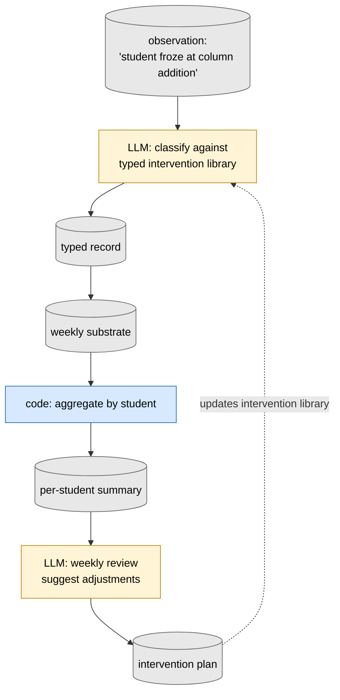

Substrate-as-vocabulary (the typed intervention library) is the load-bearing artifact — it's what the LLM classifies *against*. The teacher edits the library when they notice a recurring pattern that doesn't fit. The dev-time loop is the teacher curating the library; the runtime is per-observation classification + weekly summary.

**Prior art (no LLM, but the typed-vocabulary half is well-established)**:

- *MTSS / Multi-Tiered System of Supports* and *RTI / Response to Intervention* in K-12 — typed catalogs of evidence-based interventions teachers select from and document. See [What Works Clearinghouse](https://ies.ed.gov/ncee/wwc/) for the federally-curated library.
- *Intelligent Tutoring Systems* — [Carnegie Learning's MATHia](https://www.carnegielearning.com/), [ALEKS](https://www.aleks.com/), and the academic [Cognitive Tutor](https://en.wikipedia.org/wiki/Cognitive_Tutor) tradition (Anderson et al.). Student-facing rather than teacher-tracking, but use the same typed-skill-library shape.
- Behavior-tracking spreadsheets and IEP-management tools (e.g. [Class Dojo](https://www.classdojo.com/)) implement a deterministic version without the LLM-classification layer.

**LLM-augmented examples in the wild**: emerging but rare as of 2026. The shape above is illustrative — it's the graph an LLM-augmented MTSS or coaching tool would need.

### Coach's typed move-library

Real-time soft input (the situation in front of the coach); LLM classifies; code matches to a typed library of moves the coach has curated; LLM picks an appropriate response.

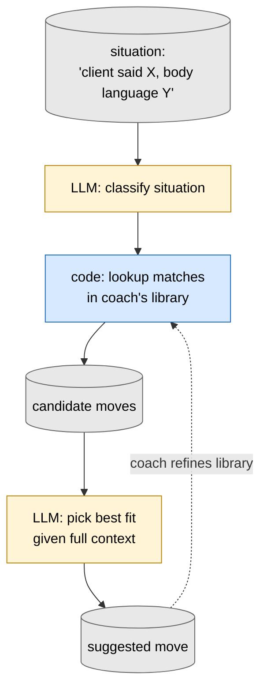

Substrate-as-vocabulary in its purest form: the move library is curated, finite, and editable by the coach. The LLM is constrained to selecting from the library rather than generating fresh advice — that constraint is the discipline that makes the system trustworthy in a domain where bad advice has real consequences.

**Prior art (typed move-libraries widely used in coaching/therapy without LLMs)**:

- *Motivational Interviewing's [OARS framework](https://en.wikipedia.org/wiki/Motivational_interviewing#OARS)* (Miller & Rollnick) — Open questions, Affirmations, Reflections, Summaries. Coaches literally classify what they just did in terms of these four moves. Canonical typed-move-library in the field.
- *The Gottman Institute's "[emotional bid](https://www.gottman.com/blog/want-to-improve-your-relationship-start-paying-more-attention-to-bids/)"* vocabulary — typed library of micro-interactions in relationships.
- *Internal Family Systems (IFS) therapy moves* — typed library of "parts" plus intervention templates clinicians work from.
- *[ICF coaching competencies](https://coachingfederation.org/credentials-and-standards/core-competencies)* — typed library of professional coaching moves used in certification.

**LLM-augmented examples in the wild**: BetterUp, [Bunch](https://www.bunch.ai/), Reach AI, and similar coaching-app startups approach this shape (closed move-library + observation-matching) but typically don't expose the typed vocabulary as editable substrate. The shape above is illustrative; the cycle is what an LLM-augmented Motivational-Interviewing-style tool would need.

---

## How to use this catalog

When designing a hybrid loop:

1. *Find the closest entry* to the surface you're scaffolding.
2. *Check what blocks differ* for your case — what's an LLM in the canonical shape but might want to be code in yours, or vice versa.
3. *Check the cycle closure* — every entry has at least one feedback edge. Where does yours close? At runtime (substrate accumulates) or at dev-time (transcripts critique-and-patch the runtime), or both?
4. *Check what's not drawn* — calibration is implicit in every entry with an LLM block; metabolism is implicit in every entry with a substrate that grows.

These are starting positions, not prescriptions. Most real projects end up as variants — substituting one block type, splitting a block into a sub-cycle, or composing two of these shapes (a runtime that's one shape, wrapped by a dev-time loop that's another).

For deeper unpacking of the algebra and how blocks compose, see `BUILDING_BLOCKS.md`. For the conceptual case behind the framework, see `THE_CASE.md`. For comparison with ecosystem tools that implement specific shapes (LangGraph, DSPy, Temporal, etc.), see `AGENT_FRAMEWORKS.md`.
